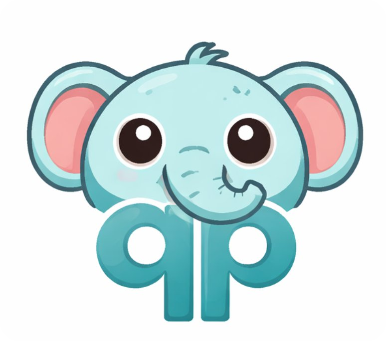

<table>
  <tr>
    <td width="200" valign="top">
      
    </td>
    <td valign="top">
      <h1>Quickly Please (qp)</h1>
      <p>
        <a href="https://github.com/neural-chilli/qp/actions/workflows/ci.yml"></a>
        <a href="https://github.com/neural-chilli/qp/actions/workflows/release.yml"></a>
        <a href="https://github.com/neural-chilli/qp/actions/workflows/docs.yml"></a>
        <a href="https://neural-chilli.github.io/qp/"></a>
        <a href="https://github.com/neural-chilli/qp/releases"></a>
        <a href="https://go.dev/"></a>
        <a href="https://github.com/neural-chilli/qp/blob/main/LICENSE"></a>
      </p>
      <p><code>qp</code> is a local-first task runner and workflow runtime for humans and agents, driven by one <code>qp.yaml</code>.</p>
      <p><strong>Docs:</strong> <a href="https://neural-chilli.github.io/qp/">Manual</a> · <a href="docs/user-guide.md">User Guide (repo)</a></p>
    </td>
  </tr>
</table>

## Quickstart

Install:

```bash
go install github.com/neural-chilli/qp/cmd/qp@latest
```

Initialize in a repo:

```bash
qp init
qp list
qp help check
qp check
qp guard
```

Minimal `qp.yaml`:

```yaml
project: my-service
default: check

tasks:
  lint:
    desc: Lint code
    cmd: golangci-lint run

  test:
    desc: Run tests
    cmd: go test ./...

  check:
    desc: Local verification
    run: par(lint, test)
```

## Common Commands

```bash
qp list
qp help <task>
qp <task>
qp guard
qp watch guard
qp check --json
qp check --events 2>events.jsonl
```

## Where To Go Next

- Full docs/manual: [https://neural-chilli.github.io/qp/](https://neural-chilli.github.io/qp/)
- Cookbook recipes: [manual/cookbook](manual/cookbook/index.qmd)
- Release process: [docs/releasing.md](docs/releasing.md)
